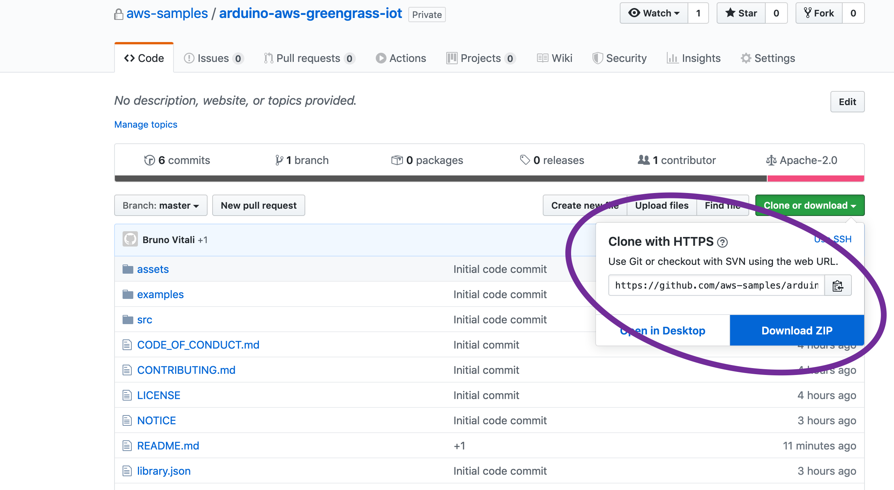

AWS IoT Arduino library for ESP32
=================================

 

This library uses AWS C-SDK to implement an Arduino class *AWSGreenGrassIoT* to
make it easy to connect sensors/actuator to AWS IoT core, directly or by
mean of an AWS greengrass device (i.e. Raspberry PI).

The class AWSGreenGrassIoT exposes the following methods:

~~~~~~~~~~~~~~~~~~~~~~~~~~~~~~~~~~~~~~~~~~~~~~~~~~~~~~~~~~~~~~~~~~~~~~~~~~~~ cpp
Constructor: AWSGreenGrassIoT(const char * AwsIoTCoreurl, // AWS IoT core URL
                              const char * thingName,     // AWS thing name
                              const char * iotCoreCA,     // AWS IoT core certificate (defined in certificate.c)
                              const char * thingCA,       // thing certificate (defined in certificates.c)
                              const char * thingKey);     // thing private key (defined in certificate.c)

 bool connectToGG(void);       // connect the device to greengrass
 bool connectToIoTCore(void);  // connect the device directly to AWS IoT Core

 bool publish(char * pubtopic, char * pubPayLoad);  // publish a JSON record to "pubTopic"
 bool subscribe(char * subTopic, pSubCallBackHandler_t pSubCallBackHandler); // subscribe to "subTopic" and define the callback function to handle the messages coming from the IoT broker
~~~~~~~~~~~~~~~~~~~~~~~~~~~~~~~~~~~~~~~~~~~~~~~~~~~~~~~~~~~~~~~~~~~~~~~~~~~~~~~~

 

Library dependencies
--------------------

 
The library is based on the latest (as of January 2020) Amazon iot C-SDK version 3.0.1
https://github.com/aws/aws-iot-device-sdk-embedded-C/releases/tag/v3.0.1. 
Future version of the SDK can be found on https://github.com/aws/aws-iot-device-sdk-embedded-C and might require a recompilation of the AWSGreengrassIoT code.
The library makes use of some standard Arduino libraries: WiFi,
WifiClientSecure, HTTPClient.

The examples requires the installation of the following libraries from public
repositories:

-   NPTClient, to synchronize the real time clock with the nptd server and
    generate timestamps for sensor measurements (in publishing examples,
    gg_SGP30_publisher and was_SGP30_publisher);

-   ADAFruit_SGP30, to use the air impurity sensor in gg_SGP30_publisher and
    was_SGP30_publisher examples;

-   ESP32Servo, to control the rotation of the servo motor in gg_subscriber and
    aws_subscriber examples;


 

Pre-requisites
--------------

1.  Install the latest Arduino IDE for your platform (the following screenshots
    will refer to the MAC OS version):
    <https://www.arduino.cc/en/main/software>;

2.  Install ESP32 board manager:

    -   From Arduino IDE main menu -\> Preferences

<p align="center">

</p>


-   Enter **https://dl.espressif.com/dl/package_esp32_index.json** into the
    “Additional Board Manager URLs” field as shown in the figure above and press
    “OK”.

    -   From Arduino IDE main Menu -\> Tools -\> Board Manager

<p align="center">

</p>


-   enter ESP32 in the search field as indicated below and install the new eps32
    board manager:

<p align="center">

</p>


-   in Tools-\> Board select your ESP32 module type, in my case ESP32 Dev Module

<p align="center">

</p>


* Install Arduino Libraries “NPTClient”, “Adafruit_SGP30”, “ESP32Servo” to be
    able to use the publishing and subscribing examples from the File menu-\>
    Examples -\> AWSGreengrassIoT). The picture below shows how to add the support
    library for simple servo motors:

<p align="center">

</p>


Installation of AWSGreengrassIoT library
----------------------------------------

 

1.  Open a browser in the code.amazon.com repository under
    <https://github.com/aws-samples/arduino-aws-greengrass-iot>

2.  download the library in zip format as indicated in the image:


<p align="center">

</p>


3.  Add the Zip file as new Arduino library in Sketch->Include Library-> Add .ZIP library:

<p align="center">

</p>


4.  Check that the library is visible in Sketch -\> Include Library, as indicated
in the screenshot below:

<p align="center">

</p>

Examples
--------

Before using the examples from the Sketch->Examples menu, please remember to:
1. create "things" in AWS IoT Core: (https://docs.aws.amazon.com/iot/latest/developerguide/register-device.html);
2. generate and download thing's certificate, thing's private key and AWS service certificate (if your endpoint is different from eu-central-1);
3. create aws_certificates.c file with the certificates/key generate in the previous step;
4. customize the Arduino sample code by definiting the parameters for your AWS IoT core Url, your "thing"  and your WiFi network:

```C+
char WIFI_SSID[]="SSID";
char WIFI_PASSWORD[]="PASSWORD";
char AWSIOTURL[]="xxxxxxxxxxxxxxx-ats.iot.region.amazonaws.com";
char THING[]= "your device name here";
```

AWSGreenGrassIoT library comes with 5 examples:

<p align="center">

</p>


aws_servo_subscriber, gg_servo_subscriber
-----------------------------------------
In these examples a servo motor is connected to Analog GPIO port XX on ESP32, and simulate the remote opening and closing of a window by turning ±90 degree the motor depending on the subscribing topic "Window". An "open" will rotate the motor +90 degrees, a "close" will rotate the motor in the opposite sense, -90 degrees.

Circuit diagram

<p align="center">

</p>


The only difference between the two examples is that:
* aws_servo_subscriber connects to AWS IoT core directly using the member function "connectToIoTCore";

```C++  
if(greengrass->connectToIoTCore() == true)
  {
      Serial.println("Connected to AWS IoT core");
      delay(2000);

     if( true == greengrass->subscribe(TOPIC_NAME,subscribeCallback)) {
          Serial.println("Subscribe to Window/# topic successful ");
     }
     else {
          Serial.println("Subscribe to Window/# Failed, Check the Thing Name and Certificates");
          while(1);
     }

   }
  else
  {
      Serial.println("Connection to AWS IoT core failed");
      while(1);
  }
```
* gg_servo_subscriber connects via a greengrass device (it could be a raspberry pi connected to the same WiFi network or a remote EC2 instance inside AWS cloud) using the member function "connectToGG";

```C++
if(greengrass->connectToGG() == true)
 {
     Serial.println("Connected to AWS GreenGrass");
     delay(2000);

    if( true == greengrass->subscribe(TOPIC_NAME,subscribeCallback)) {
         Serial.println("Subscribe to Window/# topic successful ");
    }
    else {
         Serial.println("Subscribe to Window/# Failed, Check the Thing Name and Certificates");
         while(1);
    }

  }
 else
 {
     Serial.println("Connection to Greengrass failed, check if Greengrass is on and connected to the WiFi");
     while(1);
 }
```
The callback function handling the topic subscription is the same for both use cases:

```C++
static void subscribeCallback (char *topicName, int payloadLen, char *payLoad)
{

    //check if the topic is Window/close or Window/open
    rcvdPayload = String(payLoad);
    cmdReceived = CMD_UNKNOWN;
    String topic = String(topicName);
    if ( topic.startsWith(topicClose+ "{")) {
      cmdReceived = CMD_CLOSE;
      rcvdTopic = topicClose;
    }
    else if (topic.startsWith(topicOpen + "{")) {
      cmdReceived = CMD_OPEN;
      rcvdTopic = topicOpen;
    }
    else
      rcvdTopic = topicName;
    msgReceived = 1;
}
```

aws_sgp30_publisher, gg_sgp30_publisher
---------------------------------------

These two examples use an air impurity sensor SGP30 from Adafruit connected to one of the I2C port on ESP32 as indicated in the diagram below. The examples require the installation of the ADAFruit_SGP30 library as indicated in point 3 in the previous section.

Circuit diagram
 
<p align="center">

</p>

 
The two examples share the same code except for the parts that connects the ESP32 Arduino to the cloud. In aws_sgp30_publisher we use "connectToIoTCore" function to publish the measurements directly to the AWS IoT core. In gg_sgp30_publisher we use "connectToGG" member function to send measurements to the greengrass edge device.

aws_bme280_sgp30_publisher
--------------------------

In this examples we show how to use two sensors to the same I2C bus, BME280 (temperature, humidity, pressure, altitude) and SGP30. The example sketch is similiar to aws_sgp30_publisher with the addition of the initialization and the reading of the measurements of the Adafruit BME280 sensor.

This is the circuit diagram:

<p align="center">

</p>

