AWS IoT GreenGrass Discovery temp/humid example
=================================

## Description

In this example I will demonstrate how to publish temperature and humidity readings from an ESP32 to a local Greengrass device and how to forward those messages onto AWS IoT core. This example will also show you how to subscribe to a topic and control the Red/Green Leds from the test console in AWS IoT core.

## Hardware

The parts used in this example are;
1 x ESP32 WROOM DevkitC
1 x DHT22/AM2302 Temp Humidity sensor
1 x 10k resistor
1 x LED traffic light cluster (Red/Amber/Green)

Assembled;

<p align="center">
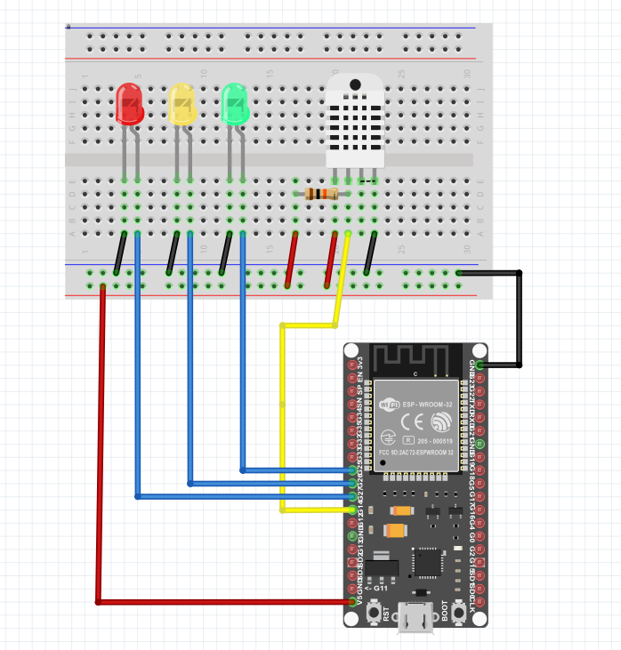
</p>

<p align="center">
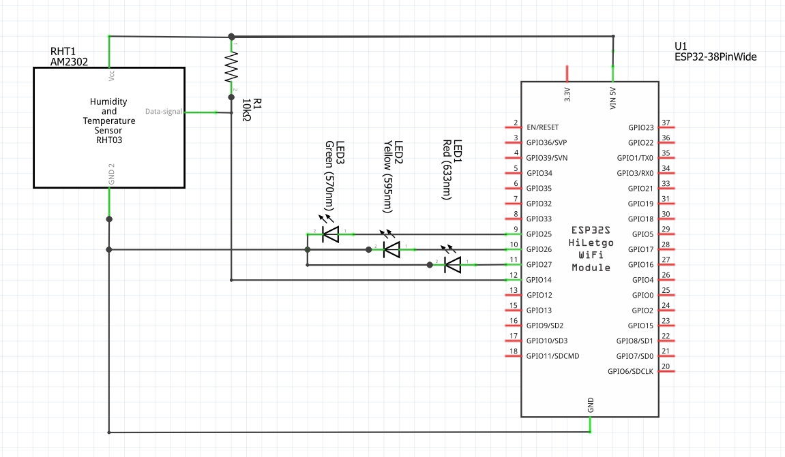
</p>


Dependencies
--------------------

The examples requires the installation of the following libraries from public
repositories:

-   NPTClient, to synchronize the real time clock with the nptd server and
    generate timestamps for sensor measurements (in publishing examples,
    gg_SGP30_publisher and was_SGP30_publisher);
-   DHT sensor library, to read the values from the DHT22 sensor in the gg_temp_humid_pub_sub example.

Pre-requisites
--------------

1.  Install the latest Arduino IDE for your platform (the following screenshots
    will refer to the MAC OS version):
    <https://www.arduino.cc/en/main/software>;

2.  Install ESP32 board manager:

    -   From Arduino IDE main menu -\> Preferences

<p align="center">
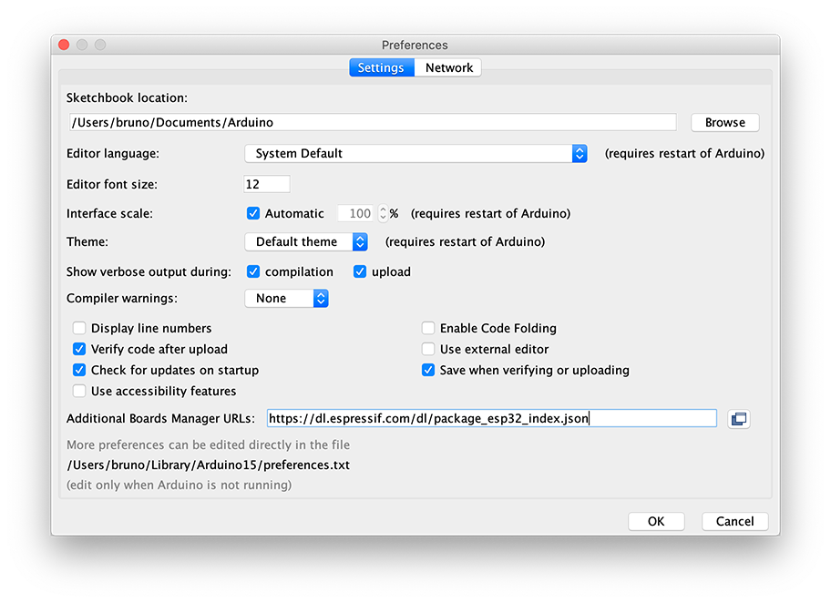
</p>


-   Enter **https://dl.espressif.com/dl/package_esp32_index.json** into the
    “Additional Board Manager URLs” field as shown in the figure above and press
    “OK”.
    -   From Arduino IDE main Menu -\> Tools -\> Board Manager

<p align="center">
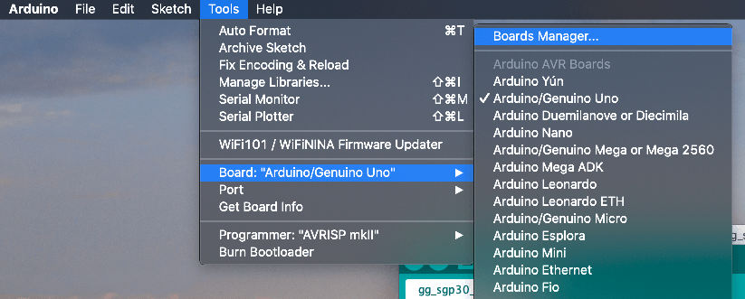
</p>


-   Enter ESP32 in the search field as indicated below and install the new eps32
    board manager:

<p align="center">
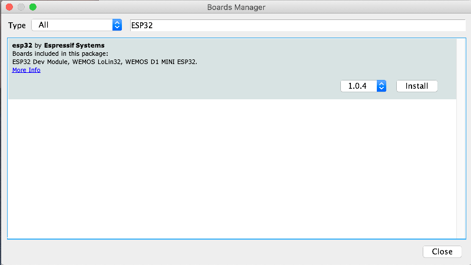
</p>


-   In Tools-\> Board select your ESP32 module type, in my case ESP32 Dev Module

<p align="center">
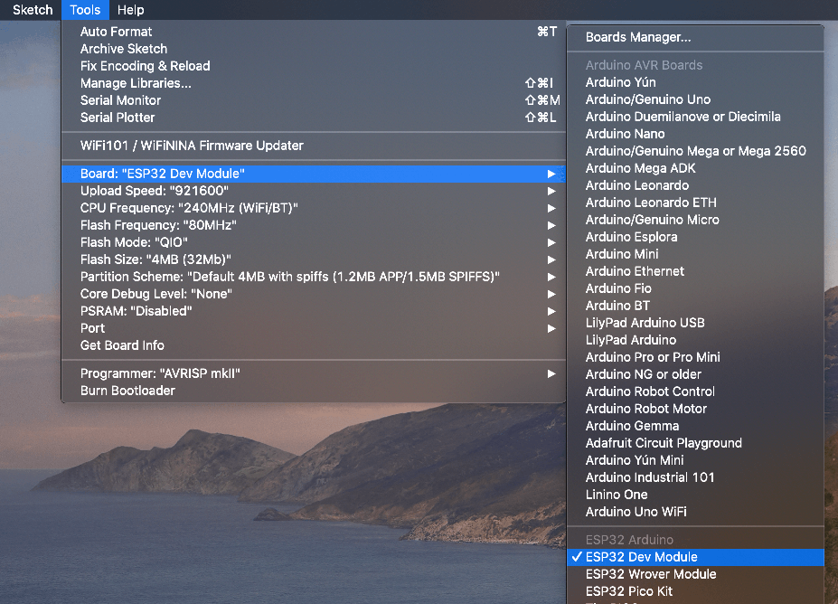
</p>


* Install Arduino Libraries (Tools>Manage Libraries...) “NPTClient”, "DHT sensor library" to be able to use the publishing and subscribing examples from the File menu-\>
  Examples -\> AWSGreengrassIoT). The picture below shows how to add the support
  library for simple servo motors:

<p align="center">
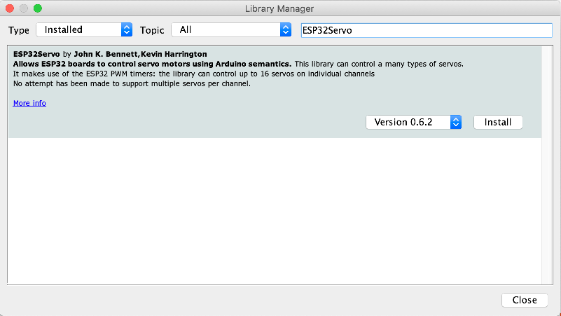
</p>


Installation of AWSGreengrassIoT library
----------------------------------------

 

1.  Open a browser in the GitHub repository under
    <https://github.com/aws-samples/arduino-aws-greengrass-iot>

2.  Download the library in zip format as indicated in the image:


<p align="center">
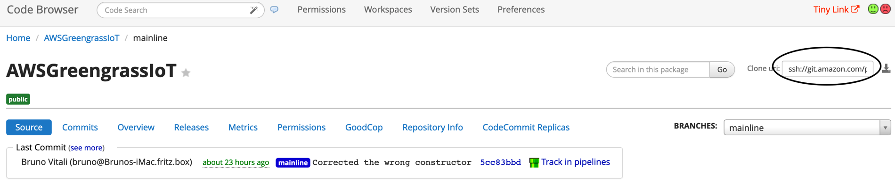
</p>


3.  Add the Zip file as new Arduino library in Sketch->Include Library-> Add .ZIP library:

<p align="center">
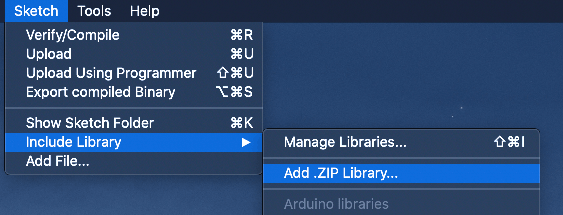
</p>


4.  Check that the library is visible in Sketch -\> Include Library, as indicated
    in the screenshot below:

<p align="center">
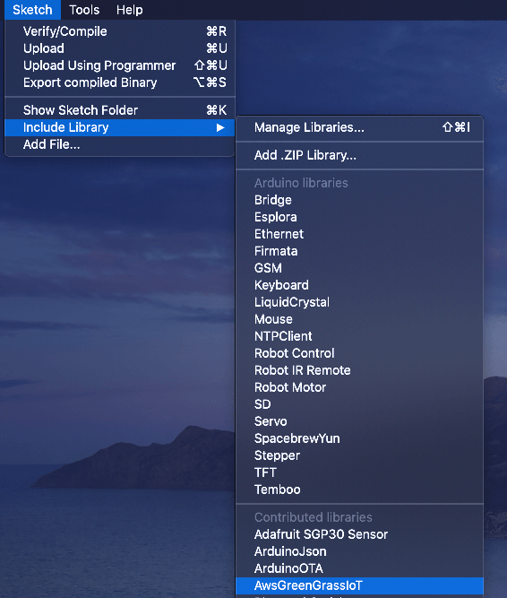
</p>

## AWS Device setup

1. Create a Greengrass group in your AWS account.
2. Within that group go to the devices sub menu and Add a Device.
3. On the next page select Create new device;
    <p align="center">
    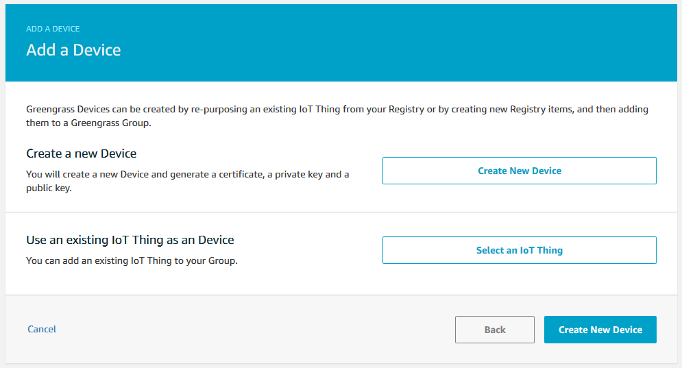
    </p>
4. Give your device a name (in my case "Temp_Humid_Sensor") and click next; 

   <p align="center">
   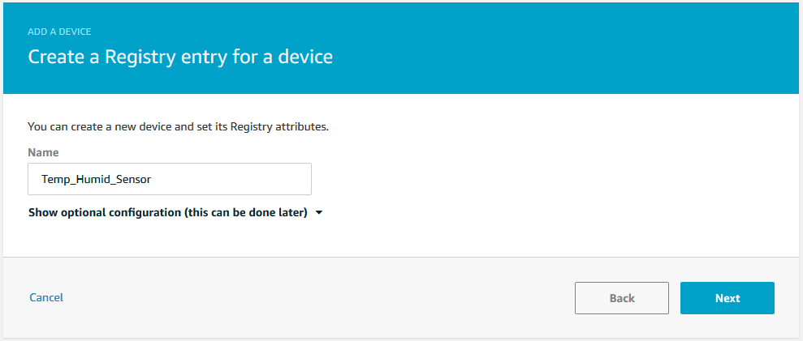
   </p>

5. Click "Use Defauts" on the next page.

   <p align="center">
   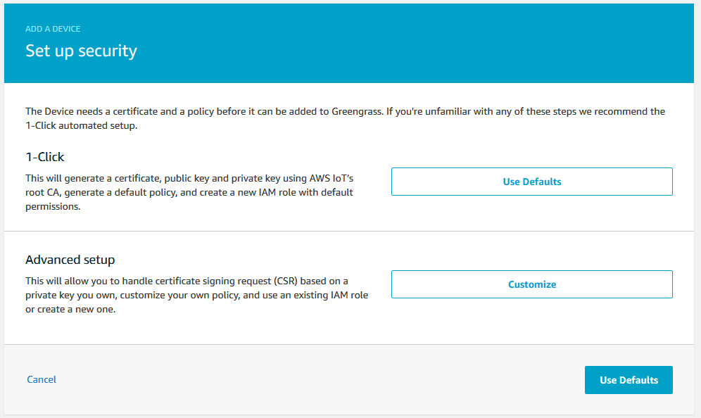
   </p>

6. On the next page download your credentials as well as a root CA (For this example I will use Amazon Root CA 1);

   <p align="center">
   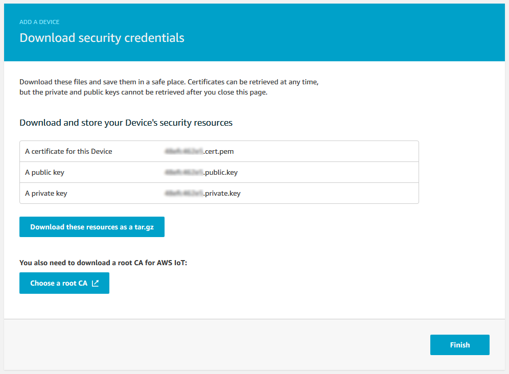
   </p>

7. Amazon Root CA can be found at https://www.amazontrust.com/repository/AmazonRootCA1.pem 

   <p align="center">
   
   </p>

8. Next Populate your "aws_certificates.c" file with your credentials *Note the use of the Newline \n\ *

9. For the "aws_root_ca[]" copy the "AmazonRootCA1.pem" from above adding the \n\ where appropriate. 

   <p align="center">
   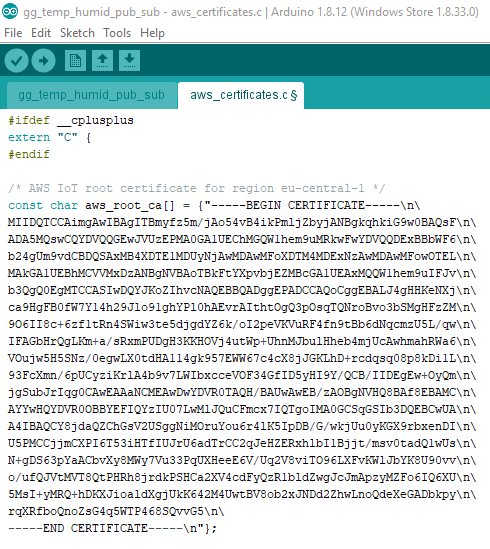
   </p>

10. The next Certificate to add is the "thingCA[]" you will find this in the downloaded xxxxx-setup.tar.gz file with the extension .cert.pem. Copy the file into the "aws_certificates.c" file adding the \n\ as appropriate. 

    <p align="center">
    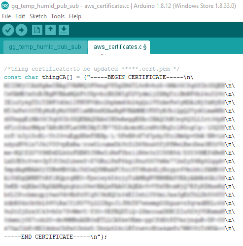
    </p>

11. Lastly add the "thingKey[]" for your device from the  file ending with .private.key from the xxxx-setup.tar.gz file. 

    <p align="center">
    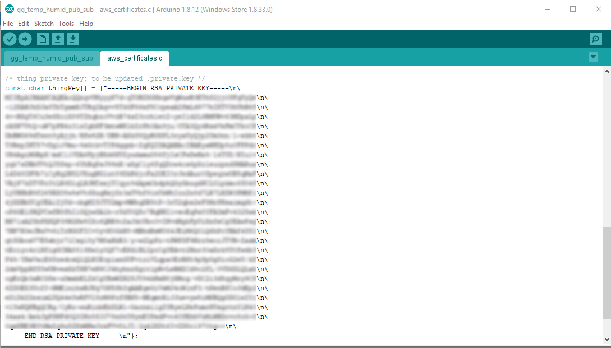
    </p>

12. You now need to deploy your GreenGrass setup so that the new device will be added and the Greengrass core will accept the local connection.

## Deploy to device.

1. Customize the Arduino sample code by editing the parameters for your AWS IoT Core URL, your "thing" and your WiFi network settings. You can also edit the topics you wish to publish and subscribe too:  

   <p align="center">
   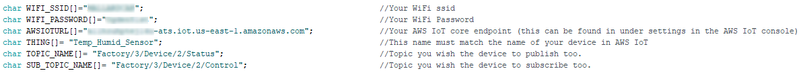
   </p>

2.  Deploy to your device and open the Arduino monitor (Tools>Serial Monitor). Make sure the comm port is set correctly and you have the baud rate set to 115200. You should see something similar to below.

   <p align="center">
   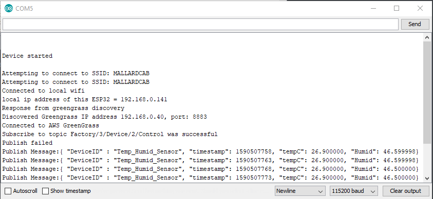
   </p>

3. You may see connection errors these could be due to latency. Delays have been implemented to mitigate this that you can adjust to your requirements.

   

## Monitoring the Device from AWS IoT Core

Now that your device is subscribing and publishing on the local GreenGrass MQTT broker you can pass the messages to other services or control the device LEDs. In the following example I will show you how to monitor the status messages from IoT Core.

1. Go into the GreenGrass group and add a subscription for your publish topic (in my case "Factory/3/Device/2/Status")  

   <p align="center">
   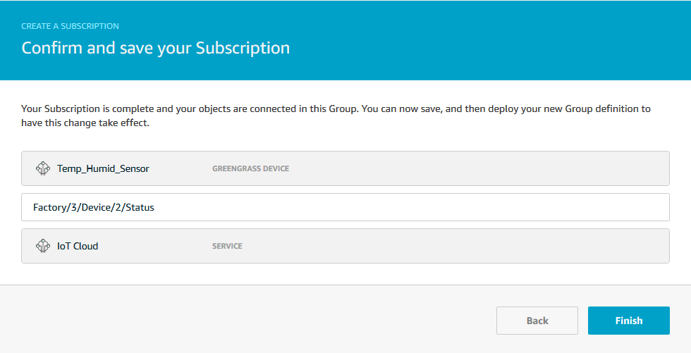
   </p>
2. You will need to deploy the updated settings to the GreenGrass group and check the ESP32 has reconnected after the update.

3. Log onto the AWS IoT console and go to the Test tab on the left, then subscribe to the topic that should be forwarded by the GreenGrass group. (in my case "Factory/3/Device/2/Status") 

   <p align="center">
   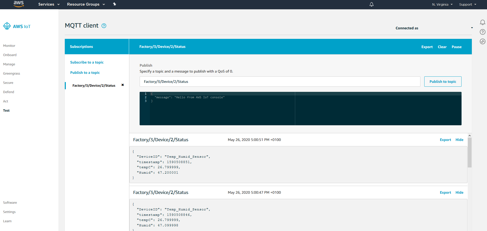
   </p>

   
## Controlling the Device from AWS IoT Core

Now that your device is subscribing and publishing on the local GreenGrass MQTT broker you can pass the messages to other services or control the device LEDs. In the following example I will show you how to control the Device LEDs from IoT Core.

1. Go into the GreenGrass group and add a subscription for your subscribe topic (in my case "Factory/3/Device/2/Control")  

   <p align="center">
   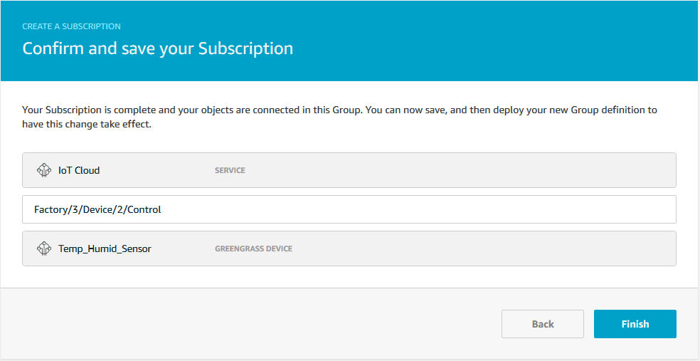
   </p>
   
2. You will need to deploy the updated settings to the GreenGrass group and check the ESP32 has reconnected after the update.

3. Log onto the AWS IoT console and go to the Test tab on the left, then "Publish to a topic" and enter the Topic that you wish to publish too, in my case "Factory/3/Device/2/Control" along with the Json to send. 

      <p align="center">
      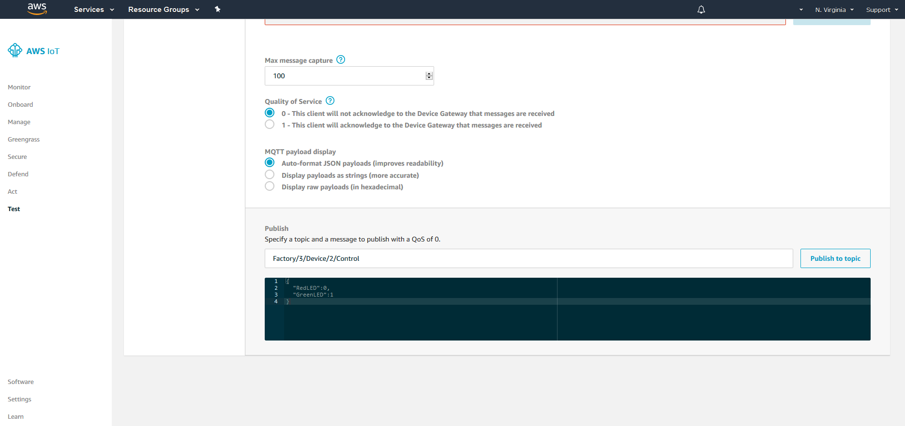
      </p>

4. You can adjust the payload to control the LEDs as desired, note there must not be spaces between the key and the value.

   ```json
   {
     "RedLED":0,
     "GreenLED":1
   }
   ```
